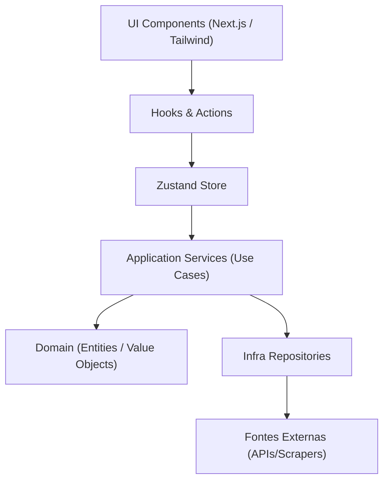

# Remote Dev Jobs – Monorepo (Turbo + pnpm)

> **Atenção**: o boilerplate genérico e independente de domínio está na **`boilerplate`** branch. A branch `main` que você está lendo agora contém uma implementação de exemplo para o domínio Remote-Dev-Jobs.

+[](https://web.dev/measure/) []() []() +[](https://nextjs.org) [](https://www.typescriptlang.org) [](https://tailwindcss.com) [ ](https://turbo.build/repo) [](https://pnpm.io) [](https://jestjs.io)

## Propósito

Este projeto nasceu de uma **dor real**: estando **open to work** como desenvolvedor, percebi que as aplicações diretas no LinkedIn não estavam gerando os resultados esperados. Decidi criar uma solução que **filtra e agrega vagas de desenvolvimento** de múltiplas fontes, facilitando minha busca por oportunidades.

### 🎯 Objetivo Principal

**Filtrar vagas de desenvolvimento** de forma eficiente, agregando dados de **diversas fontes** (APIs e scrapers) em uma única interface, com foco especial em vagas **remotas** e do **mercado brasileiro**.

### 🚀 Como Evoluiu

O que começou como uma ferramenta pessoal se transformou em um exemplo prático de como construir uma plataforma de **vagas remotas** com tecnologia de ponta, mantendo **qualidade**, **performance** e **escala**:

- Arquitetura **DDD** enxuta — camadas **Core → Application → Infra → Web** isoladas por regras ESLint.
- Pipeline de qualidade automatizado: **Jest** (unit/integration), Turbo cache, Husky + lint-staged.
- UI moderna com **Next.js 14 (App Router)**, **TailwindCSS** e componentes reutilizáveis do pacote `ui`.
- Segurança e performance de produção (CSP via `@next-safe/middleware`, PWA scores ≥95 no Unlighthouse).
- **IA integrada** com JSearch API para busca inteligente de vagas usando GPT-3 + BERT.

Use-o como ponto de partida em novos projetos ou como vitrine do que já dominamos 🚀

## Estrutura

1. **root** – pnpm workspace configurado (Turbo, Husky, Commitlint, ESLint/Prettier, Changesets)
2. **apps/web** – Next.js 14 (App Router) + TypeScript + Tailwind
3. **packages/core** – Domínio puro (entidades, value-objects, repositórios)
4. **packages/application** – Casos de uso orquestrando o domínio
5. **packages/infra** – Implementações externas (Remotive API, Supabase, etc.)
6. **packages/ui** – Biblioteca de componentes React compartilhados
7. **packages/config** – Presets ESLint + Prettier + boundaries rules

## Clean Code & Arquitetura

Este projeto segue um conjunto de diretrizes para garantir um código limpo, manutenível e escalável.

### Princípios de Código
- **Funções Curtas**: Máximo de 20 linhas e apenas um nível de abstração interna.
- **Nomenclatura Clara**: Métodos de ação seguem o padrão `verboSubstantivo` (ex: `toggleFavorite`, `getJobs`).
- **Evite `utils` Genéricos**: Prefira nomes de domínio específicos (ex: `DateRange` em vez de `dateUtils`).
- **Injeção de Dependência**: O `core` depende apenas de interfaces; implementações concretas ficam em `infra`.

### Arquitetura em Camadas
As dependências entre os pacotes são rigorosamente controladas pela regra `boundaries` do ESLint.

- `core`: Não possui dependências externas.
- `application`: Depende apenas do `core`.
- `infra`: Depende apenas do `core`.
- `web`: Depende de `application` e `ui`.

### Pirâmide de Testes
- **Testes Unitários**: Foco em `core` e `application`, usando Jest e contratos de repositório.
- **Testes de Integração**: Foco em `infra`, com mocks mínimos para serviços externos.
- **Testes End-to-End (E2E)**: Foco em `web`, simulando a jornada completa do usuário (Cypress/Playwright).

> Siga estas práticas em novas features e PRs para manter a consistência e a qualidade do projeto.

## Fluxo de Camadas



## Histórico de Decisões de Arquitetura

Nós auditamos periodicamente o repositório para garantir que ele continue honrando os princípios de design e arquitetura documentados. A última revisão resultou nas seguintes melhorias:

- **Qualidade dos Dados**: Fontes de vagas instáveis ou com dados imprecisos (ex: `Arbeitnow`, `Hipsters.jobs`) foram desativadas para melhorar a relevância dos resultados.
- **Simplificação da Busca**: A lógica de busca por palavra-chave foi movida do `core` para as fontes de dados, simplificando o domínio.
- **Correção da UI de Filtros**: O comportamento do filtro de busca foi corrigido para limpar a URL quando o campo é esvaziado.
- **Gerenciamento de Cache**: Adicionado um endpoint (`/api/cache/clear`) para facilitar a limpeza do cache de vagas durante o desenvolvimento.
- **Centralização da Lógica de Domínio**: A lógica de deduplicação e filtro de vagas, que estava duplicada, foi extraída para os serviços `JobDeduplicator` e `JobFilterService` no pacote `core`.
- **Separação de Responsabilidades (SRP) nas Factories**: A `JobRepoFactory` foi dividida. Agora, `JobRepoFactory` cria apenas repositórios simples, enquanto a nova `AggregateRepoFactory` lida com a criação de repositórios agregados.
- **Segurança de Tipos (Type Safety)**: Uma refatoração completa eliminou o uso de `any` em toda a aplicação `web`, fortalecendo a robustez do código.
- **Configuração de Ferramentas (Tooling)**: O ESLint e o Prettier foram configurados para funcionar de forma coesa no monorepo, garantindo a aplicação consistente de padrões de código.

### Próximos Passos e Oportunidades

- **Cobertura de Testes**: Adicionar métricas de cobertura de testes no CI, especialmente para os pacotes `core` e `application`.
- **Centralização de Erros**: Criar mappers de erro no pacote `infra` para evitar o vazamento de detalhes de implementação para as camadas superiores.
- **Eventos de Domínio**: Avaliar a introdução de eventos de domínio para funcionalidades futuras, como a persistência de favoritos de usuários.
- **Autenticação**: Implementar um fluxo de autenticação completo com Supabase.

## Por que este repositório é um Boilerplate completo?

Este projeto serve como ponto de partida para qualquer aplicação full-stack Next.js + TypeScript porque já entrega:

| Pilar            | O que já vem pronto                                                      | Benefício                    |
| ---------------- | ------------------------------------------------------------------------ | ---------------------------- |
| Produtividade    | Next 14 (App Router), Tailwind, Plop generators                          | Comece a codar em minutos    |
| Arquitetura      | Camadas Core → Application → Infra → Web; regras `boundaries`            | Escala e testes sem dívidas  |
| Qualidade        | ESLint (+jsx-a11y, formatjs, unused-imports), Prettier, Tailwind sorting | Código limpo por padrão      |
| Testes           | Jest unit + contract; Infra integração; E2E (slot)                       | Pirâmide de testes pronta    |
| CI & Performance | Turbo cache, Unlighthouse ≥95, Husky + lint-staged                       | Feedback rápido e confiável  |
| Segurança        | `@next-safe/middleware` (CSP), dependabot ready                          | Boas práticas desde o início |
| Versionamento    | Changesets para publicar pacotes (ex.: `ui`)                             | Reuso dentro ou fora do mono |

> Basta focar na lógica de negócio e UI; infraestrutura e boas práticas já estão pavimentadas.

## Arquitetura

A estrutura do monorepo é dividida em pacotes (`packages`) e aplicações (`apps`), com responsabilidades bem definidas:

```
packages/
  core        – Entidades, Value Objects e contratos (interfaces) do domínio. Ex: Job, JobRepository.
  application – Casos de uso que orquestram a lógica de negócio. Ex: GetJobs, GetJobDetails.
  infra       – Implementações concretas de interfaces do core. Ex: RemotiveRepo, AggregateJobRepo, JobRepoFactory.
  ui          – Componentes React compartilhados para a UI. Ex: JobCard, Button.
  config      – Configurações compartilhadas de ESLint e Prettier.
apps/
  web         – Aplicação Next.js com UI e um Backend-for-Frontend (BFF) usando Route Handlers.
```

### Fluxo de Dados (Exemplo: Busca de Vagas)

1.  A página (`JobsSection`) renderiza os filtros e, quando alterados, chama uma ação na store do Zustand (`useJobsStore`).
2.  A ação na store dispara uma requisição para a API interna do Next.js (ex: `/api/jobs`).
3.  O Route Handler (`/api/jobs/route.ts`) atua como um BFF:
    a. Utiliza a `getJobsFactory` para criar uma instância do caso de uso `GetJobs`.
    b. A factory, por sua vez, usa a `AggregateRepoFactory` para montar um repositório agregado com todas as fontes de vagas ativas.
4.  O caso de uso `GetJobs` executa a busca, utilizando os serviços de domínio `JobFilterService` e `JobDeduplicator` para processar os resultados.
5.  A resposta final é retornada para a store, que atualiza a UI.

### Execução local

```bash
# 1. Instalar dependências
pnpm install

# 2. Configurar variáveis de ambiente (opcional)
cp .env.example .env
# Edite o arquivo .env e adicione sua JSEARCH_API_KEY

# 3. Compilar todos os pacotes
pnpm turbo run build

# 4. Iniciar a aplicação web em modo de desenvolvimento
pnpm --filter web dev
```

### Configuração de APIs

Para usar a funcionalidade de IA com JSearch:

1. **Obtenha uma API key gratuita** em [RapidAPI JSearch](https://rapidapi.com/letscrape-6bRBa3QguO5/api/jsearch)
2. **Crie um arquivo `.env`** na raiz do projeto
3. **Adicione sua API key**: `JSEARCH_API_KEY=sua_chave_aqui`

A aplicação funcionará normalmente sem a API key, mas sem a funcionalidade de IA.

### Funcionalidades Principais

#### 🔍 Filtros Inteligentes

- **Por palavra-chave**: Cargo, empresa, tecnologia, etc.
- **Por tipo de trabalho**: Remoto, Presencial, Híbrido.
- **Por data de publicação**: Últimas 24h, semana, mês.

#### 🤖 IA Integrada

- **JSearch API**: Busca inteligente usando GPT-3 + BERT em múltiplas plataformas
- **Dados estruturados**: Informações extraídas automaticamente (skills, benefícios, salário)
- **Filtros automáticos**: Apenas vagas remotas retornadas
- **200 requests/mês gratuitos** no plano Basic da RapidAPI

#### ⚡ Performance Otimizada

- **Cache local**: IndexedDB para dados persistentes
- **Rate limiting**: 20 minutos entre requests por fonte
- **Deduplicação**: Remove vagas duplicadas automaticamente
- **SSR + CSR**: Dados carregados no servidor, filtros no cliente

#### 🛡️ Anti-Rate Limiting

- **Sincronização inteligente**: O cache é populado de forma controlada para evitar bloqueios.
- **Fallback robusto**: Em caso de erro, a aplicação pode usar dados de um cache local (IndexedDB).
- **Controle granular**: O rate limit é configurável por fonte de dados.

### Filtros disponíveis

Exemplo de uma URL com filtros:
`/api/jobs?q=react&workType=remote&datePosted=7`

---
