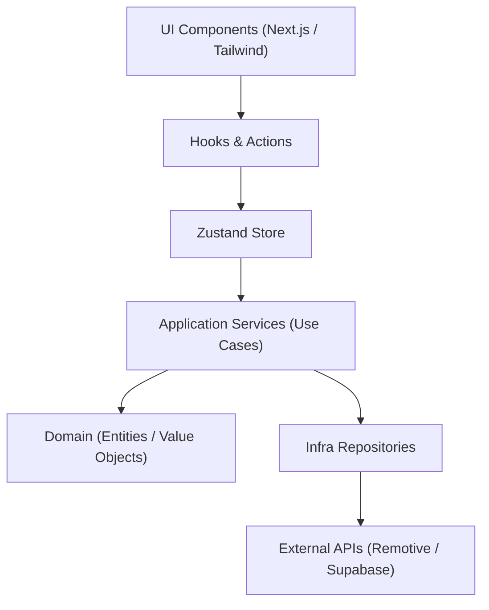

# Remote Dev Jobs – Monorepo (Turbo + pnpm)
+  

## Estrutura

1. **root** – pnpm workspace configurado (Turbo, Husky, Commitlint, ESLint/Prettier compartilhados)
2. **apps/web** – Next.js 14 (App Router) + TypeScript + Tailwind
3. **packages/core** – Domínio puro (entidades, value-objects, repositórios)
4. **packages/application** – Casos de uso orquestrando o domínio
5. **packages/infra** – Implementações externas (Remotive API, Supabase, etc.)
6. **packages/ui** – Biblioteca de componentes React compartilhados
7. **packages/config** – Presets ESLint + Prettier + boundaries rules

## Clean Code & Arquitetura

🔹 Funções com **máx. 20 linhas** e **apenas 1 nível** de abstração interna.
🔹 Métodos de ação seguem padrão **verboSubstantivo** (`toggleFavorite`, `getJobs`).
🔹 Evite `utils` genéricos – prefira nomes de domínio (ex.: `DateRange`).
🔹 **Core depende só de interfaces**; implementações concretas ficam em *infra*.
🔹 Camadas (via `eslint-plugin-boundaries`):
   • core → nenhum
   • application → core
   • infra → core
   • web → application
🔹 Pirâmide de testes:
   • **unit** – core & application (Vitest + contratos)
   • **integration** – infra (mock externo mínimo)
   • **e2e** – web (Cypress/Playwright)

> Siga estas práticas em novas features e PRs.

## Fluxo de Camadas

