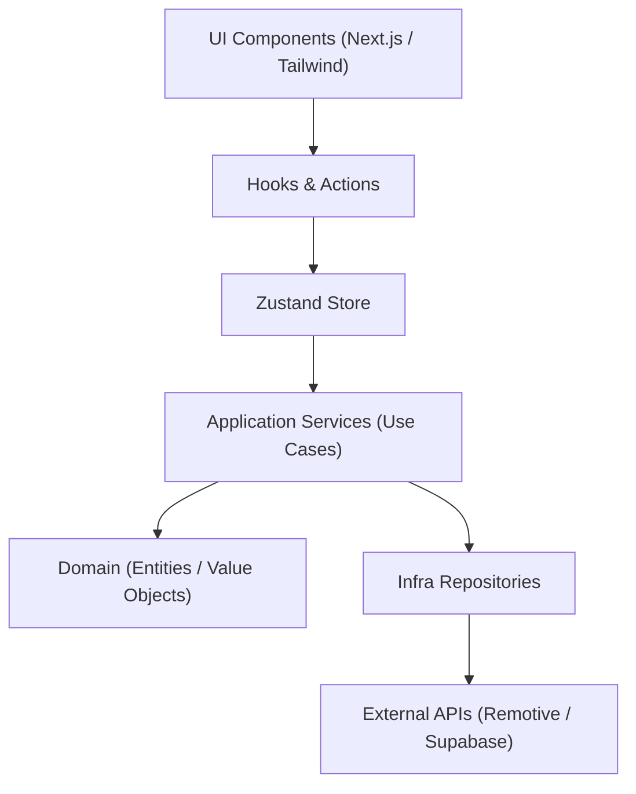

# Remote Dev Jobs – Monorepo (Turbo + pnpm)

> **Atenção**: o boilerplate genérico e independente de domínio está na **`boilerplate`** branch. A branch `main` que você está lendo agora contém uma implementação de exemplo para o domínio Remote-Dev-Jobs.

+[](https://web.dev/measure/) []() []()
+[](https://nextjs.org) [](https://www.typescriptlang.org) [](https://tailwindcss.com) [ ](https://turbo.build/repo) [](https://pnpm.io) [](https://jestjs.io)

## Propósito

Este repositório mostra, na prática, como construir uma plataforma de **vagas remotas** com tecnologia de ponta, mantendo **qualidade**, **performance** e **escala**:

* Arquitetura **DDD** enxuta — camadas **Core → Application → Infra → Web** isoladas por regras ESLint.
* Pipeline de qualidade automatizado: **Jest** (unit/integration), Turbo cache, Husky + lint-staged.
* UI moderna com **Next.js 14 (App Router)**, **TailwindCSS** e componentes reutilizáveis do pacote `ui`.
* Segurança e performance de produção (CSP via `@next-safe/middleware`, PWA scores ≥95 no Unlighthouse).

Use-o como ponto de partida em novos projetos ou como vitrine do que já dominamos 🚀

## Estrutura

1. **root** – pnpm workspace configurado (Turbo, Husky, Commitlint, ESLint/Prettier, Changesets)
2. **apps/web** – Next.js 14 (App Router) + TypeScript + Tailwind
3. **packages/core** – Domínio puro (entidades, value-objects, repositórios)
4. **packages/application** – Casos de uso orquestrando o domínio
5. **packages/infra** – Implementações externas (Remotive API, Supabase, etc.)
6. **packages/ui** – Biblioteca de componentes React compartilhados
7. **packages/config** – Presets ESLint + Prettier + boundaries rules

## Clean Code & Arquitetura

🔹 Funções com **máx. 20 linhas** e **apenas 1 nível** de abstração interna.
🔹 Métodos de ação seguem padrão **verboSubstantivo** (`toggleFavorite`, `getJobs`).
🔹 Evite `utils` genéricos – prefira nomes de domínio (ex.: `DateRange`).
🔹 **Core depende só de interfaces**; implementações concretas ficam em *infra*.
🔹 Camadas (via `eslint-plugin-boundaries`):
   • core → nenhum
   • application → core
   • infra → core
   • web → application
🔹 Alias de importação:
   • `@/*` → `apps/web/src/*`
   • `@remote-dev-jobs/<pkg>` → `packages/<pkg>/`
🔹 Segurança: middleware `@next-safe/middleware` com CSP básico.
🔹 Lint extra: `eslint-plugin-unused-imports`, `prettier-plugin-tailwindcss`.
🔹 Pirâmide de testes:
   • **unit** – core & application (Jest + contratos)
   • **integration** – infra (mock externo mínimo)
   • **e2e** – web (Cypress/Playwright)

> Siga estas práticas em novas features e PRs.

## Fluxo de Camadas



## Revisão de Arquitetura e SRP (Maio 2025)

Nós auditamos periodicamente o repositório para garantir que ele continue honrando os princípios documentados acima.

### ✅ O que está funcionando bem
1. **Single-Responsibility Principle (SRP)**  
   • `packages/core` mantém somente entidade/VO e contratos.  
   • `packages/application` apenas orquestra casos de uso.  
   • `packages/infra` contém detalhes de integração externos.  
   • `apps/web` concentra UI + BFF embutido (Route Handlers).  
   Cada diretório tem um motivo único para mudar.
2. **Camadas protegidas**  
   `eslint-plugin-boundaries` impede dependências ilegais (ex.: infra → web).  
   Alias de paths claros (`@remote-dev-jobs/*`).
3. **Clean-Code rules**  
   – Funções curtas (<20 linhas) e claras.  
   – Convenção `verboSubstantivo` nos métodos (`toggleFavorite`, `listAll`).  
   – Sem *utils* genéricos; `lib/` está restrito ao domínio de UI.
4. **Pirâmide de Teste**  
   – Contrato de repositório no core.  
   – Testes unitários no core/application.  
   – Infra possui integração mock (Remotive).  
   – Web focará em E2E.

### 🚧 Oportunidades de melhoria
1. **Coverage** – adicionar métricas de cobertura no CI para core/application.
2. **Naming** – padronizar textos i18n já no início para evitar literais.
3. **Error handling** – centralizar mappers de erro em infra para não vazar detalhes externos.
4. **Domain events** – avaliar necessidade quando favoritos persistirem em Supabase.

> Próxima revisão arquitetural planejada após introdução de autenticação real e favoritos em Supabase. 

## Por que este repositório é um Boilerplate completo?

Este projeto serve como ponto de partida para qualquer aplicação full-stack Next.js + TypeScript porque já entrega:

| Pilar | O que já vem pronto | Benefício |
|-------|--------------------|-----------|
| Produtividade | Next 14 (App Router), Tailwind, Plop generators | Comece a codar em minutos |
| Arquitetura | Camadas Core → Application → Infra → Web; regras `boundaries` | Escala e testes sem dívidas |
| Qualidade | ESLint (+jsx-a11y, formatjs, unused-imports), Prettier, Tailwind sorting | Código limpo por padrão |
| Testes | Jest unit + contract; Infra integração; E2E (slot) | Pirâmide de testes pronta |
| CI & Performance | Turbo cache, Unlighthouse ≥95, Husky + lint-staged | Feedback rápido e confiável |
| Segurança | `@next-safe/middleware` (CSP), dependabot ready | Boas práticas desde o início |
| Versionamento | Changesets para publicar pacotes (ex.: `ui`) | Reuso dentro ou fora do mono |

> Basta focar na lógica de negócio e UI; infraestrutura e boas práticas já estão pavimentadas. 

## Arquitetura

```
packages/
  core        – Entidades e contratos (Job, JobRepository)
  application – Casos de uso (GetJobs)
  infra       – Adaptadores externos (RemotiveRepo, ArbeitnowRepo, GreenhouseRepo, LeverRepo, AggregateJobRepo)
  ui          – Componentes compartilhados (JobCard, JobList, Button)
apps/
  web         – BFF + UI Next.js (rota /api/jobs, páginas, tailwind)
```

### Fluxo
1. UI chama `/api/jobs` (BFF).
2. A rota usa `getJobsFactory` → `GetJobs`.
3. `GetJobs` consulta `AggregateJobRepo`, que reúne dados dos repositórios individuais.
4. Resposta deduplicada é devolvida para a UI.

### Execução local
```bash
pnpm install
pnpm turbo run build # compila pacotes
pnpm --filter web dev   # inicia Next.js
```

### Filtros disponíveis
`/api/jobs?stack=react&seniority=senior&location=brazil`

--- 