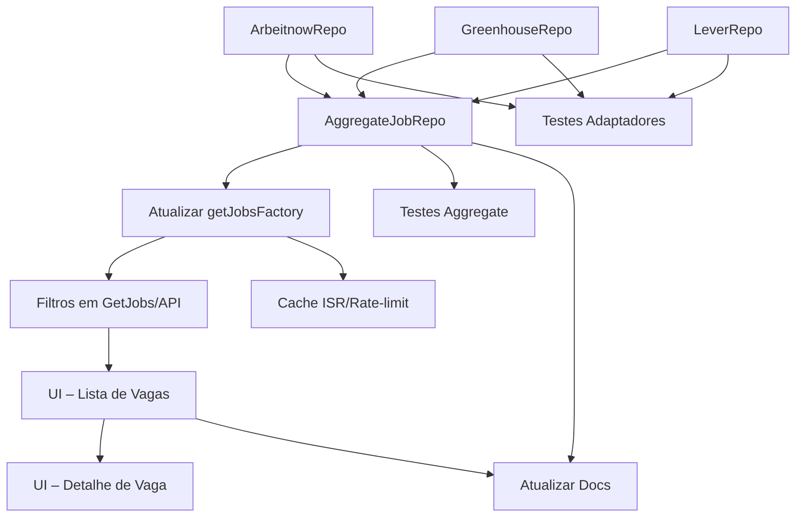

- **Remote Dev Jobs Hub – Roadmap**

Abaixo está a lista de tarefas pendentes para evoluirmos o projeto. Marque cada item quando concluído.

### Tarefas

- [ ] **Criar adaptador ArbeitnowRepo** que implementa `JobRepository` consumindo a API pública da Arbeitnow
- [ ] **Criar adaptador GreenhouseRepo** que implementa `JobRepository` consumindo a API pública da Greenhouse
- [ ] **Criar adaptador LeverRepo** que implementa `JobRepository` consumindo a API pública da Lever
- [ ] **Implementar AggregateJobRepo** que recebe múltiplos repositórios (Remotive, Arbeitnow, Greenhouse, Lever) e devolve lista unificada e deduplicada
- [ ] **Atualizar getJobsFactory** para usar `AggregateJobRepo`
- [ ] **Adicionar filtros** (por stack, senioridade, localização) ao caso de uso **GetJobs** e à rota `/api/jobs`
- [ ] **Criar componentes UI** (`JobCard`, `JobList`) e página de listagem consumindo `getJobsAction`
- [ ] **Criar página de detalhes** da vaga com redirecionamento para URL original
- [ ] **Escrever testes unitários** para `AggregateJobRepo` e deduplicação
- [ ] **Escrever testes de integração** para cada adaptador chamando API mockada
- [ ] **Configurar cache ISR e rate-limit** no BFF Next.js
- [ ] **Atualizar documentação** (README e ADRs) com novas integrações e arquitetura
